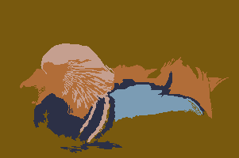
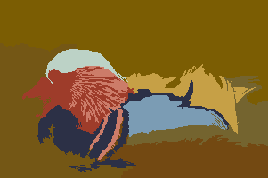
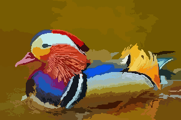
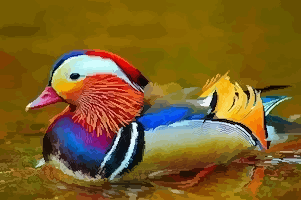

# A Tiny Image Segmentation

|||
:---: | :---: |:---: | :---:


- CS 310 Programming Assignment 3

## Assignment Objective
- Write a program to segment an image into _K_>1 regions, where _K_ is a user parameter.
- Learn to use _priority queue_ (binary heap) and _disjoint sets_ (union-find data structure)
- Review Set and List
- Practice Java Collections Framework APIs
- Image segmentation is one of the most fundamental operations in computer vision and image processing and has many many applications; [Learn more about image segmentation from Wikipedia](https://en.wikipedia.org/wiki/Image_segmentation)

## Table of Contents
1. [Input/Output](#input-output)
2. [Examples](#examples)
4. [Definitions](#definitions)
5. [Tasks](#tasks)


## Input Output

### Input
- A single bitmap RGB image in jpg or png formats.
- A positive integer _K_ > 1, i.e., the number of final regions

### Output

Your program should output: (1) regional information and (2) re-colored image.

- A list of regions ordered from large to small (pixel count). Each line of your terminal output (System.out) will contain
  1. size of the region, this is the number of pixels in the region
  2. color of the region, this color is the average color of all pixels in the region
- An image file, in which, all pixels in the same region are assigned the average color of the region.
  - The image filename must be named **ABCD_seg_K.png** if your input file is "ABCD.xyz" where xyz is jpg or png and _K_ is the input argument _K_
- See [example output](#examples) below; your program must reproduce the same output.

## Examples

0. Compile the code

```
> javac *java
```

1. Segment into two regions


```
> java cs310pa3 -k 2 image/tiny.png
region 1 size= 50 color=java.awt.Color[r=246,g=141,b=145]
region 2 size= 50 color=java.awt.Color[r=17,g=88,b=38]
- Saved result to image/tiny_seg_2.png
```

|
:---: | :---:
input|output


```
> java cs310pa3 -k 2 image/2-1.png
region 1 size= 8168 color=java.awt.Color[r=252,g=252,b=253]
region 2 size= 3232 color=java.awt.Color[r=64,g=88,b=146]
- Saved result to image/2-1_seg_2.png
```

|
:---: | :---:
input|output

2. Segment into 3 or 4 regions

```
> java cs310pa3 -k 3 image/3.png
region 1 size= 5079 color=java.awt.Color[r=140,g=72,b=140]
region 2 size= 4862 color=java.awt.Color[r=252,g=251,b=252]
region 3 size= 159 color=java.awt.Color[r=245,g=240,b=245]
- Saved result to image/3_seg_3.png

> java cs310pa3 -k 4 image/3.png
region 1 size= 4862 color=java.awt.Color[r=252,g=251,b=252]
region 2 size= 4065 color=java.awt.Color[r=141,g=56,b=141]
region 3 size= 1014 color=java.awt.Color[r=136,g=135,b=136]
region 4 size= 159 color=java.awt.Color[r=245,g=240,b=245]
- Saved result to image/3_seg_4.png
```
||
:---: | :---: | :---:
input|_K_=3|_K_=4

3. Segment into K>3 regions

```
> java cs310pa3 -k 10 image/Leiadeathstar.jpg
region 1 size= 12705 color=java.awt.Color[r=26,g=30,b=38]
region 2 size= 12169 color=java.awt.Color[r=32,g=35,b=43]
region 3 size= 7095 color=java.awt.Color[r=209,g=217,b=224]
region 4 size= 5796 color=java.awt.Color[r=191,g=197,b=208]
region 5 size= 5016 color=java.awt.Color[r=132,g=148,b=175]
region 6 size= 3535 color=java.awt.Color[r=126,g=89,b=82]
region 7 size= 3199 color=java.awt.Color[r=227,g=218,b=220]
region 8 size= 1925 color=java.awt.Color[r=156,g=105,b=92]
region 9 size= 1346 color=java.awt.Color[r=145,g=133,b=131]
region 10 size= 1214 color=java.awt.Color[r=96,g=109,b=129]
- Saved result to image/Leiadeathstar_seg_10.png

> java cs310pa3 -k 100 image/Leiadeathstar.jpg
region 1 size= 4732 color=java.awt.Color[r=13,g=17,b=23]
region 2 size= 3756 color=java.awt.Color[r=41,g=53,b=77]
region 3 size= 2545 color=java.awt.Color[r=9,g=13,b=12]
region 4 size= 2496 color=java.awt.Color[r=10,g=13,b=11]
[snipped...]
region 100 size= 34 color=java.awt.Color[r=60,g=78,b=106]
- Saved result to image/Leiadeathstar_seg_100.png
```

||
:---: | :---: | :---:
input|_K_=10|_K_=100

4. Need more examples? Look under [output folder](output)

## Definitions

Please familiarize yourself with these terms and their definitions before you move on.

### Pixel

- In this assignment, a pixel is a 2D coorindate of an image.
- You can use a pixel to retrieve its color from an image.
- A pixel _(w,h)_ can also be represented as a unique id _(h*W+w)_, where _W_ is the width of the image

### Region

- A region is a set of contiguous pixels.
- A pixel can only belong to one region.
- Consequently, a region is a set in the disjoint sets data structure.
- The color of a region is the average color of all pixels in the region.
- A region is identified by one of its pixels that is the root in the disjoint sets data structure.
- Two regions are neighbors if some of their pixels are adjacent. For example, region _E_ is neighboring to regions _A_, _C_, _G_, but not regions _B_, _D_, _F_ in the image below.


### Similarity

- Similarity is the color distance (a.k.a. color difference) between a pair of adjacent regions.
- Smaller distance indicates stronger similarity.
- The similarity between a pair of non-adjacent regions is undefined.

## Tasks

There are **5** tasks in this assignment. It is recommended that you implement these tasks in the given order.

### Task 0: Read the given code (0%)

Read and familiarize yourself with the code, in particular the following classes and methods in Decomposor.java

This will save you a lot of time later.

```java

private class Pair<T>{...}

private class Pixel extends Pair<Integer>{...}

private class Similarity implements Comparable<Similarity>{}

//Convert a pixel to its ID
private int getID(Pixel pixel);

//Convert ID back to a pixel
private Pixel getPixel(int id);

//Get the color of a given pixel
private Color getColor(Pixel p)

//Given a collection of pixels, determine the average color
private Color computeAverageColor(AbstractCollection<Pixel> pixels);

//Compute the difference (as an integer) between two colors
private int getDifference(Color c1, Color c2);

//Get the pixels adjacent to the pixel
private ArrayList<Pixel> getNeightbors(Pixel pixel);
```

### Task 1: Implement Disjoint Sets (the union-find data structure) (20%)

- Implement Set<T> in Set.java **(5%)**
- Implement DisjointSets<T> in DisjointSets.java **(15%)**

_Hints_
- Each Set represents a [region](#region) of contiguous pixels
- Initially every pixel is its own region
- You can use/modify the DisjointSets code from your textbook

```java
//in Set.java
public class Set<T>{...} //must provide add, addAll, clear, and iterator
```

```java
//in DisjointSets.java
public class DisjointSets<T>
{
    //Constructor
    public DisjointSets( ArrayList<T> data  );

    //Compute the union of two sets using union by size
    //returns the new root of the unioned set
    //Must be O(1) time
    public int union( int root1, int root2 );

    //Find and return the root
    //Must implement path compression
    public int find( int x );

    // get all the data in the same set
    // must be O(1) time
    public Set<T> get( int root );

    // return the number of disjoint sets remaining
    // must be O(1) time
    public int getNumSets(  );

    private int [ ] s;
    private ArrayList<Set<T>> sets; //actual data
}
```

### Task 2: Get Neighboring Sets (10%)

Implement getNeightborSets function in Decomposor.java

Given a disjoint-sets data structure and a region (defined by its root id), return a list of adjacent regions (again, represented by their root ids) which are DIFFERENT from the parameter region.

```java
private TreeSet<Integer> getNeightborSets(DisjointSets<Pixel> ds, int root);    
```

_Hints_: Use TreeSet<T> and the following private method.

```java
private ArrayList<Pixel> getNeightbors(Pixel pixel)
```

### Task 3: Compute region to region similarity (15%)

Given two regions _R1_ and _R2_, implement a function to compute the similarity between these two regions.

**High-level idea**

Let _R_ be the union of _R1_ and _R2_, and [let _C_ be the color of _R_](#region). We are interested in knowing the cost of changing all pixels in _R_ to color _C_. Thus, the error induced by uniting _R1_ and _R2_ is the sum of the differences between _C_ and all pixels in _R_. Apparently, we would like to have this error as small as possible to produce a good segmentation.

**Here is what you should do**

Compute the color _C_ of region _R_ without actually computing the union of _R1_ and _R2_.
To do so, _C_ can be computed with the following formula:
- _C_.red = ((_C1_.red * #-of-pixels-in-_R1_)+(_C2_.red * #-of-pixels-in-_R2_))/(total-number-of-pixels-in-_R1_-and-_R2_)
Here _C1_ and _C2_ are the colors of _R1_ and _R2_, respectively.
- _C_.blue and _C_.green are defined exactly the same.

To compute the distance, you'll need to compute **the sum of all color differences** between _C_ and all pixels in _R1_ and _R2_.

Hint 1: Iterate through all pixels and sum the result returned by the getDifference() helper function.

Hint 2: Return a new ```Similarity``` where distance is the sum computed above, and the two pixels are the pixels of root1 and root2.

```java
private Similarity getSimilarity(DisjointSets<Pixel> ds, int R1, int R2);
```

### Task 4: Implement the decomposor (50%)

Implement the following method

```java
public void segment(int K) //K is the number of desired segments
```

**High-level idea**

- Iteratively merging two adjacent regions with most similar colors until the number of regions is _K_.
- **When two regions _R1_ and _R2_ are merged into a new region _R_, the similarities between _R_ and its neighbors must be estimated and added to the queue as the color of _R_ is different from the colors of _R1_ and _R2_.**

**Here is what you should do** in this function:

1. Create ```DisjointSets<Pixel>``` and populate it with all pixels
2. Create ```PriorityQueue<Similarity>```, which should contain all possible pairs of neighboring pixels and their similarity values. Use your ```getSimilarity``` (from task 3) to compute the similarity.
3. Loop until the number of regions equals _K_; in each iteration,
  - You must use ```PriotityQueue<Similarity>``` to find a pair of most similar regions **represented by two pixels (_p1_, _p2_) with similarity _S_**
  - If the regions represented by _p1_ and _p2_ are _not_ disjoint, ignore the pair
  - Otherwise
  	1. If _p1_ **or** _p2_ is no longer roots of their own regions (this may have happened due to an earlier union):
		- if the similarity distance is greater than 0 (in other words, the two pixel regions were not identical), add the roots of _p1_ and _p2_ back into the queue (there may be higher priority things than the union of the two roots).
		- if the similarity distance is 0 (in otherwords, the two regions were identical)
	  		- union the roots (as you can't be any more similar than a distance of 0).
	2. If _p1_ and _p2_ are both roots of their own regions:
		- **If ```getSimilarity``` of _p1_ and _p2_ returns a similarity different from _S_, ignore the pair** (again, due to an earlier union)
		- Otherwise
			- union the pair (we'll call this new region _R_)
			- **If the similarity distance is NOT 0** 
				- measure ```Similarity``` between all pairs of _R_ and _R_'s neighboring regions using ```getNeightborSets``` and ```getSimilarity```
				- add each new similarity to your priority queue


### Bonus: Speedup Segmentation (10+10%)

**Details coming soon.**
Your code is going to be very slow even on a small image, e.g. 500x500 (250K) pixels. 
Improve the speed of your code and earn extra points.

### You may

1. Import the following libraries
```java
import java.util.ArrayList;
import java.util.LinkedList;
import java.util.Comparator;
import java.util.Collections;
import java.io.File;
import java.io.IOException;
import javax.imageio.ImageIO;
import java.awt.Graphics;
import java.awt.Image;
import java.awt.image.BufferedImage;
import java.awt.Color;
import javax.swing.JPanel;
import javax.swing.JFrame;
```

2. Use code from your text book _Data Structures and Problem Solving Using Java_, 4th Edition by _Mark A. Weiss_

#### Manual/Automatic Testing (100%)
- Your output images will be compared with our terminal text output. 
- In addition to the text output, you can also compare 
images using [ImageMagick](https://www.imagemagick.org/script/index.php) via the following command
```
magick compare  -metric RMSE image/your-output.png image/my-ouput.png diff.png
```
The output should be "0 (0)" when these two images are identical. 

_However, your assignment will be graded with text output only without ImageMagick_


#### Manual Code Inspection (Optional)
- If your code failed more than 3 out of 10 tests above, you may request a manual inspection and you will be         graded based on the points assigned to each task. If you request a manual inspection, you can no longer use the score you get from "Manual/Automatic        Testing"; To use this grade, your code  (a) must compile and (b) is an "honest attempt" at the assignment.

#### Manual Code Inspection Rubric (10% "off the top" points)
These are all "off the top" points (i.e. items that will lose you points rather than earn you points):

Inspection Point | Points | High (all points) | Med (1/2 points) | Low (no points)
:---: | :---: | :--- | :--- | :---
Submission Format (Folder Structure) |  2 |  Code is in a folder which in turn is in a zip file. Folder is correctly named. | Code is not directly in user folder, but in a sub-folder. Folder name is correct or close to correct. | Code is directly in the zip file (no folder) and/or folder name is incorrect.
Code Formatting | 2 | Code has a set indentation and formatting style which is kept consistent throughout and code looks "well laid out".| Code has a mostly consistent indentation and formatting style, but one or more parts do not match.|Code indentation and formatting style changes throughout the code and/or the code looks "messy".
JavaDocs | 3 | The entire code base is well documented with meaningful comments in JavaDoc format. Each class, method, and field has a comment describing its purpose. Occasional in-method comments used for clarity. | The code base has some comments, but is lacking comments on some classes/methods/fields or the comments given are mostly "translating" the code. | The only documentation is what was in the template and/or documentation is missing from the code (e.g. taken out).
Coding conventions | 3 | Code has good, meaningful variable, method, and class names. All (or almost all) added fields and methods are properly encapsulated. For variables, only class constants are public. | Names are mostly meaningful, but a few are unclear or ambiguous (to a human reader) [and/or] Not all fields and methods are properly encapsulated. |  Names often have single letter identifiers and/or incorrect/meaningless identifiers. [Note: i/j/k acceptable for indexes.] [and/or] Many or all fields and methods are public or package default.

### External Links
- [What is digital image, a.k.a raster graphics](https://wiki.scratch.mit.edu/wiki/Raster_Graphics)
- [Wikipedia page on raster graphics](https://en.wikipedia.org/wiki/Raster_graphics)
- [Wikipedia page on pixel](https://en.wikipedia.org/wiki/Pixel)
- [Java official tutorial on image](https://docs.oracle.com/javase/tutorial/2d/overview/images.html)
- [Java official tutorial on loading and saving image](https://docs.oracle.com/javase/tutorial/2d/images/index.html)
